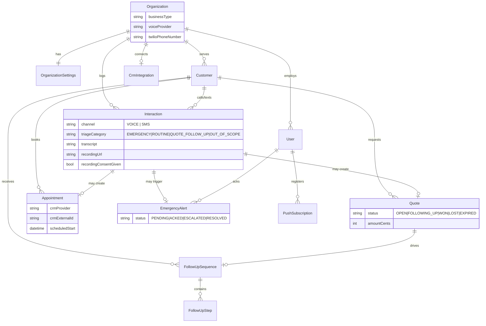

# AI Receptionist for HVAC 
 — Backend Architecture

Source requirement: [`AI_Receptionist_HVAC_Technical_Architecture_and_Costing`](https://docs.google.com/document/d/1_x0Kpej6h3hSC7eMmAIjTr7HSyd9WoFWDPZ7JhLDKGs/edit) (the tech/cost addendum to the product PRD — Features 1–5 and PRD §7–10 referenced below live in that separate PRD, not reproduced here; this doc works from what the addendum exposes about them).

This is the backend for a multi-tenant SaaS product: each HVAC/plumbing client org gets an AI phone/text receptionist that triages inbound contact into an emergency, a routine booking, a quote to follow up on, or an out-of-scope/cold lead — plus a system-initiated retention/rebooking flow — and a mobile-first dashboard for the owner.

## 1. Decisions made and why

| Decision | Choice | Why |
|---|---|---|
| Backend framework | NestJS / TypeScript | PRD lists NestJS or FastAPI as equal options; TypeScript matches the Next.js dashboard, letting types (and eventually a shared package) flow between them. |
| Voice provider (v1) | Retell AI / Vapi (Option B) | PRD's own explicit pilot recommendation — de-risks telephony/handoff before optimizing cost. |
| Voice provider (planned) | Gemini Live + Twilio bridge (Option A) | Migration path once Option B's handoff/reliability patterns are proven; isolated behind `VoiceProviderAdapter` so the swap touches only `src/voice/`. |
| DB | PostgreSQL via Prisma 6 | Matches PRD's Supabase/RDS recommendation. Pinned to Prisma 6 (not 7) to keep a plain `DATABASE_URL` connection string — Prisma 7 requires driver-adapter wiring that adds complexity with no benefit here. |
| Jobs | BullMQ + Redis | PRD lists Inngest or BullMQ; BullMQ needs no extra hosted service and integrates natively with Nest. |
| Auth | Supabase Auth | JWT verified in `src/auth`; app-side `User` row carries org membership + role, Supabase owns credentials. |
| Deployment | One isolated backend + DB per client org (v1) | Matches PRD §5.3/§6 cost model. Schema is multi-tenant-shaped (`organizationId` on every table) anyway, so a later move to shared infra is a deploy-config change, not a schema migration. |

## 2. System flow

Two inbound-triggered paths (call/text → triage → booking or escalation → follow-up) and one system-initiated path (retention/rebooking). Colors match the source doc's diagram key.

```mermaid
flowchart TD
    subgraph Inbound["Inbound contact"]
        call[["📞 Inbound call<br/>(Retell/Vapi)"]]
        sms[["💬 Inbound SMS<br/>(Twilio)"]]
    end

    call --> webhook[Voice webhook controller]
    sms --> smswebhook[Twilio SMS webhook controller]

    webhook --> triage{{TriageService<br/>shared tool-call handler}}
    smswebhook -->|Gemini text classify| triage

    triage -->|tag_emergency| emergency["🔴 EMERGENCY"]
    triage -->|book_appointment| routine["🟢 ROUTINE_SCHEDULING"]
    triage -->|create_quote| quote["🟡 QUOTE_FOLLOW_UP"]
    triage -->|log_out_of_scope| cold["⚪ OUT_OF_SCOPE / cold"]

    emergency --> alert[AlertsService:<br/>push → SMS → voice call<br/>escalation chain]
    routine --> crm[(CalendarCrmAdapter:<br/>ServiceTitan / Housecall Pro /<br/>Jobber / Google Calendar)]
    quote --> followup[FollowUpService:<br/>day 2 / 5 / 10 SMS sequence]

    subgraph Retention["System-initiated (🟣 retention)"]
        cron["Daily cron sweep:<br/>lastJobCompletedAt older than<br/>retentionCadenceMonths"]
    end
    cron --> followup

    alert --> dashboard[["📱 Owner dashboard<br/>(mobile-first)"]]
    followup --> dashboard
    crm --> dashboard
```

## 3. Data model (ERD)



Full field-level schema: [`backend/prisma/schema.prisma`](backend/prisma/schema.prisma).

## 4. Why triage is one engine, not two

The requirement ("both channels share triage logic") is enforced structurally, not by convention: `TriageService.handleToolCall()` in `backend/src/triage/triage.service.ts` is the single place that turns a tool call (`tag_emergency`, `book_appointment`, `create_quote`, `check_availability`, `log_out_of_scope`) into a DB write + side effect (alert, CRM booking, follow-up sequence). Both entry points feed it the same shape:

- **Voice**: Retell/Vapi calls our webhook when their LLM invokes a function during the call → `VoiceWebhookController` parses it via the active `VoiceProviderAdapter` → `handleToolCall()`.
- **SMS**: `TwilioSmsWebhookController` → `TriageService.handleInboundSms()` → Gemini text classification (same tool schemas, same system prompt from `triage.prompt.ts`) → `handleToolCall()`.

`triage.prompt.ts`'s `buildTriageSystemPrompt()` is interpolated into both the voice agent's system prompt and the SMS classifier's prompt — editing triage behavior means editing one file.

## 5. Emergency escalation (PRD §7: "cannot wait on the owner opening the dashboard")

`AlertsService.triggerEmergencyAlert()` fires the moment `tag_emergency` is handled, independent of whether anyone has the dashboard open:

1. Notify tier 0 of `OrganizationSettings.emergencyEscalationChain` (push + SMS).
2. Schedule a BullMQ delayed job for `emergencyAckTimeoutSeconds` later.
3. If nobody has called `POST /alerts/:id/ack` by then, `EmergencyEscalationProcessor` notifies the next tier — escalating as far as an outbound Twilio voice call reading a TwiML alert script.
4. Acking cancels the pending job so a late tier never fires after someone's already on it.

## 6. Follow-up & retention (Features 3 & 4)

`FollowUpService` schedules each step of a sequence as its own BullMQ delayed job (not one job that loops), so any individual pending step can be cancelled the moment a quote is marked WON/LOST or the customer opts out — without disturbing steps already sent. A daily cron (`runRetentionSweep`) finds customers past `retentionCadenceMonths` since their last completed job and starts a retention sequence; another daily cron expires stale quotes.

TCPA/opt-out (PRD §10) is enforced in `MessagingService.sendSms()` itself for every marketing-flagged send — not just in the agent's prompt — and the Twilio SMS webhook intercepts STOP-family keywords before they ever reach triage.

## 7. CRM/calendar — the flagged highest-risk dependency

`CalendarCrmAdapter` (`backend/src/calendar-crm/`) is the seam: triage/booking code calls `checkAvailability`/`bookAppointment` without knowing which of ServiceTitan, Housecall Pro, Jobber, or the Google Calendar fallback is behind it. The four adapters are scaffolded with real method signatures but stubbed HTTP calls — each is blocked on the same thing the PRD calls out: per-client partner/API access that has to be validated before a delivery timeline is quoted. Housecall Pro (API-key auth, no partner gate) is the fastest one to finish first.

## 8. Voice provider swap path

`VoiceProviderAdapter` normalizes Retell/Vapi webhook events into one shape (`VoiceFunctionCallEvent`, `VoiceCallEndedEvent`). `GeminiLiveProvider` intentionally does *not* fit that webhook shape — Gemini Live is a persistent WebSocket session, not request/response — so it's scaffolded as a documented stub explaining that the real Option A implementation needs a separate Twilio Media Streams gateway calling `TriageService` in-process. That gateway is out of scope for this pass; everything else (triage, booking, follow-up, dashboard) doesn't change when it's built.

## 9. Dashboard (`dashboard/`)

Next.js 16 App Router, Supabase Auth (magic link), shadcn/ui. Every dashboard page reads/writes through the backend's JWT-guarded REST API — no direct DB access from the frontend, so the backend stays the single place tenant-scoping and role checks are enforced (see `src/auth/current-user.decorator.ts`'s comment on why).

The emergency-alert requirement ("can't wait on the owner opening the dashboard") gets two independent surfaces client-side: a sticky banner on every page (`components/emergency-banner.tsx`) and a live count badge in the nav (`components/alert-count-badge.tsx`), both polling `/alerts` every 10–15s. True push (service worker, background tab) is intentionally not wired yet — see §11.

Full breakdown: [`dashboard/README.md`](dashboard/README.md).

## 10. What's real vs. stubbed right now

Backend: [`backend/README.md`](backend/README.md#whats-stubbed-vs-real). Dashboard: [`dashboard/README.md`](dashboard/README.md#whats-real-vs-stubbed).

## 11. Not yet built (next steps)

- **Retell AI integration** — deliberately last per the current build sequencing (HVAC flow proven end-to-end first). `backend/src/voice/providers/retell.provider.ts` has real webhook parsing/signature verification; `syncAgentConfig()` (pushing the triage prompt + tools to a live Retell agent) is still a stub waiting on a Retell account + agent id.
- Gemini Live + Twilio Media Streams bridge (Option A).
- Real CRM adapter HTTP calls (pending per-client API/partner access) — Housecall Pro first (API-key auth, no partner gate).
- Firebase project + service worker for true background push (`NotificationsService` backend-side, `push-permission.tsx` frontend-side are both waiting on it).
- Audit logging writes (the `AuditLog` table exists in the schema; nothing writes to it yet).
- Photo/video intake (explicitly out of scope for v1 per the source doc).
